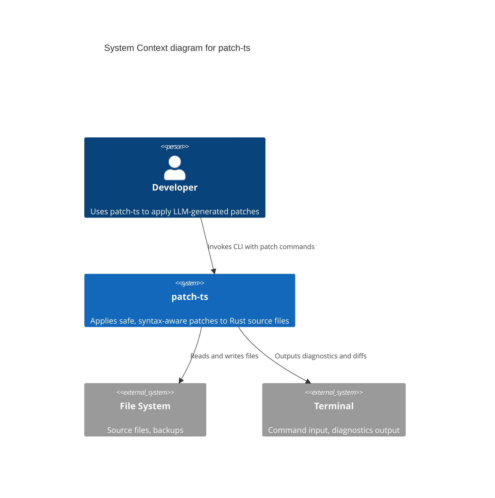
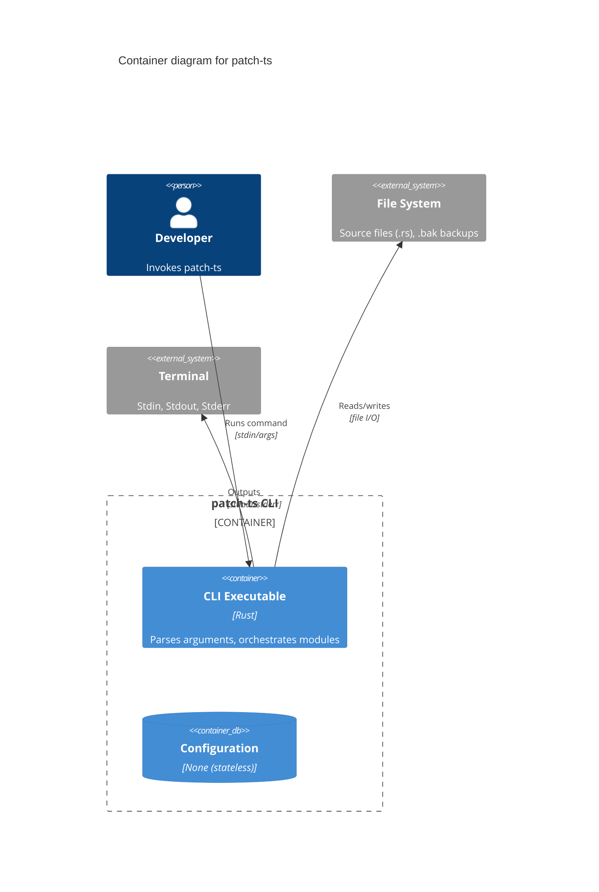
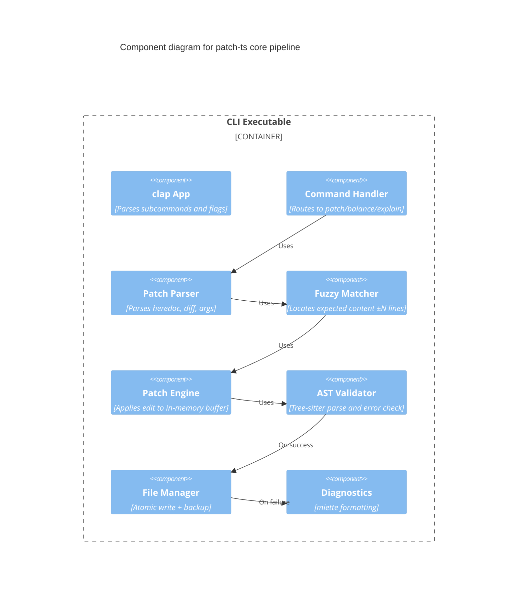

# Architecture & Design Specification

| Field | Value |
|-------|-------|
| Project | `patch-ts` |
| Document | Architecture & Design Specification |
| Version | 1.0 |
| Date | 2026-04-19 |
| Author | AI-assisted (spec-writer) |
| Status | Draft — Pending Review |

---

## 1. Context and Scope

### 1.1 Objective

This document describes the architectural design of `patch-ts` v1.0. It defines the system's high‑level structure, key design decisions, data flows, and the rationale behind major technology and pattern choices. It serves as the primary technical reference for implementation and future evolution.

### 1.2 Problem Statement

`patch-ts` is a CLI tool that must:

- Accept multiple patch input formats (heredoc blocks, unified diffs, command‑line arguments).
- Locate target lines with tolerance for drift (fuzzy matching).
- Validate that edits do not introduce syntax errors using Tree‑sitter.
- Provide structural repair and diagnostic capabilities.

The architecture must be modular, testable, and extensible to other languages in the future.

### 1.3 Relationship to Requirements

This design addresses the Architecturally Significant Requirements (ASRs) derived from the SRS:

| ASR ID | Source SRS ID | Description |
|--------|---------------|-------------|
| **ASR‑001** | REQ-NFR-001, REQ-NFR-002 | Patch and repair operations must complete in ≤100ms/200ms for typical files. |
| **ASR‑002** | REQ-NFR-010, REQ-IF-011 | File writes must be atomic and never corrupt data. |
| **ASR‑003** | REQ-FUNC-030 | AST validation must block writes that introduce syntax errors. |
| **ASR‑004** | REQ-FUNC-050, REQ-FUNC-052 | Must support delimiter balancing and error explanation using Tree‑sitter. |
| **ASR‑005** | REQ-NFR-060 | Core logic must be language‑agnostic to enable future multi‑language support. |
| **ASR‑006** | REQ-FUNC-020, REQ-FUNC-010 | Must handle both unified diff and literal block patch inputs. |

---

## 2. Goals and Non‑goals (Design Level)

### Goals

- **Modular separation** of CLI parsing, patch application, AST operations, and file I/O.
- **Single‑pass AST validation**: parse once for validation; avoid redundant parsing.
- **Language abstraction**: isolate Rust‑specific logic behind a trait to facilitate future language additions.
- **Atomic writes** via tempfile + rename.
- **Rich diagnostics** using `miette` for source snippets and suggestions.

### Non‑goals

- **Multi‑threaded parsing**: files are small; synchronous parsing is sufficient.
- **Incremental parsing across edits**: full re‑parse per operation is acceptable.
- **Network services or daemon mode**: purely CLI.
- **IDE integration**: out of scope for v1.

---

## 3. Architecturally Significant Requirements (ASRs) Mapping

The following table links each ASR to the design elements that address it.

| ASR | Design Response |
|-----|-----------------|
| **ASR‑001** (Performance) | Use `tree-sitter` incremental parsing where applicable; avoid unnecessary allocations; profile hot paths. |
| **ASR‑002** (Data Integrity) | `FileManager` module implements atomic write using `tempfile`. |
| **ASR‑003** (AST Validation) | `Validator` module compares AST `ERROR` node counts before/after patch. |
| **ASR‑004** (Structural Repair) | `RepairEngine` module uses Tree‑sitter `ERROR` nodes and heuristics to propose delimiter fixes. |
| **ASR‑005** (Language Extensibility) | `Language` trait abstracts parsing, node queries, and repair. `RustLanguage` implements it. |
| **ASR‑006** (Multiple Input Formats) | `PatchParser` module with strategy pattern: `HeredocParser`, `DiffParser`, `ArgsParser`. |

---

## 4. System Overview and High‑Level Structure

`patch-ts` follows a **pipeline architecture** where data flows through discrete, composable stages.

```
┌─────────────┐    ┌──────────────┐    ┌──────────────┐    ┌─────────────┐
│   CLI       │───▶│ Patch Parser │───▶│ Patch Engine │───▶│ Validator   │
│  (clap)     │    │  (heredoc,   │    │ (fuzzy match │    │ (AST check) │
└─────────────┘    │   diff, etc) │    │   & apply)   │    └─────────────┘
                   └──────────────┘    └──────────────┘           │
                                                                  ▼
┌─────────────┐    ┌──────────────┐    ┌──────────────┐    ┌─────────────┐
│Diagnostics  │◀───│   Repair     │◀───│ File Manager │◀───│ (if valid)  │
│ (miette)    │    │   Engine     │    │ (tempfile,   │    │    Write    │
└─────────────┘    └──────────────┘    │   backup)    │    └─────────────┘
```

**Key modules:**

| Module | Responsibility |
|--------|---------------|
| `cli` | Parse command‑line arguments and dispatch to appropriate handler. |
| `patch` | Parse input (heredoc, diff, arguments), locate target lines with fuzzy matching, apply edit. |
| `ast` | Language‑agnostic wrapper around Tree‑sitter; provides parsing, node queries, and error detection. |
| `repair` | Implement `balance` and `explain` commands using AST analysis. |
| `file` | Read source files, write atomic updates, manage backups. |
| `diagnostics` | Format errors using `miette`; support human and JSON output. |

---

## 5. C4 Model Views

### 5.1 System Context (C1)



### 5.2 Container Diagram (C2)



### 5.3 Component Diagram (C3) — Patch Pipeline



---

## 6. Architecture Decision Records (ADRs)

### ADR‑001: Use Tree‑sitter for Parsing and Validation

**Status:** Accepted  
**Date:** 2026-04-19  
**Context:** Need to validate Rust syntax and support structural repair. Options: (a) shell out to `rustc`, (b) use `syn` crate, (c) use Tree‑sitter.

**Decision Drivers:** ASR‑001 (performance), ASR‑003 (validation), ASR‑004 (repair), ASR‑005 (extensibility).

**Considered Options:**

| Option | Pros | Cons |
|--------|------|------|
| Shell out to `rustc --parse-only` | 100% accurate | Slow process spawn; no AST node info for repair; hard to get byte ranges. |
| `syn` crate | Fast, pure Rust | Designed for macro expansion, not error recovery; parsing fails on first error, no `ERROR` nodes. |
| **Tree‑sitter** | Incremental, error‑tolerant, provides `ERROR` nodes, language‑agnostic, fast. | C library dependency; grammar may have edge‑case gaps. |

**Decision Outcome:** Use Tree‑sitter with `tree-sitter-rust` grammar.

**Consequences:**

- **Positive:** Fast parsing, excellent error recovery, enables `balance` and `explain` commands. Language abstraction trait possible.
- **Negative:** Adds build dependency on C compiler; grammar version must be pinned.

---

### ADR‑002: Atomic Writes via `tempfile` + `persist`

**Status:** Accepted  
**Date:** 2026-04-19  
**Context:** Need to ensure files are never left in a corrupted or partially written state (ASR‑002).

**Decision Drivers:** ASR‑002, reliability.

**Considered Options:**

| Option | Pros | Cons |
|--------|------|------|
| Write directly to file | Simple | Risk of partial write on crash/error; no rollback. |
| Write to `.tmp` and rename | Atomic on POSIX | Need to handle cross‑filesystem renames. |
| **`tempfile` crate with `persist`** | Battle‑tested, handles edge cases, provides named temporary file. | Slight overhead. |

**Decision Outcome:** Use `tempfile::NamedTempFile` and call `persist()` after successful validation.

**Consequences:**

- **Positive:** Guarantees atomic replacement; automatically cleans up temp file on error.
- **Negative:** None significant.

---

### ADR‑003: Fuzzy Matching Using Similarity Threshold

**Status:** Accepted  
**Date:** 2026-04-19  
**Context:** Line numbers reported by compiler errors may be stale. Need to locate expected content even if line number shifted (REQ-FUNC-010, ASR‑006).

**Decision Drivers:** Usability, robustness.

**Considered Options:**

| Option | Pros | Cons |
|--------|------|------|
| Exact line only | Simple | Fails frequently. |
| Search entire file | Could find wrong match | Expensive; false positives. |
| **Search ±N lines with similarity threshold** | Balances speed and accuracy. | Requires tuning threshold. |

**Decision Outcome:** Search within `--fuzz` radius (default 5). Use Levenshtein ratio from `strsim`; require ≥0.9 similarity for match.

**Consequences:**

- **Positive:** Handles typical line shifts robustly.
- **Negative:** May produce false match if code is repetitive; mitigated by context in expected block.

---

### ADR‑004: Diagnostics with `miette`

**Status:** Accepted  
**Date:** 2026-04-19  
**Context:** Need rich, source‑code‑aware error messages for both humans and LLMs (REQ-FUNC-060, REQ-FUNC-061).

**Decision Drivers:** Diagnostic quality, JSON output support.

**Considered Options:**

| Option | Pros | Cons |
|--------|------|------|
| Plain `eprintln!` | Simple | No source snippets; hard to parse. |
| `ariadne` | Beautiful reports | No built‑in JSON; more manual work. |
| **`miette`** | Integrates with `thiserror`, supports fancy and JSON output, source snippets. | Slightly heavier. |

**Decision Outcome:** Use `miette` with `fancy` feature for terminal output and a custom JSON handler for `--json` flag.

**Consequences:**

- **Positive:** Consistent, professional diagnostics with minimal effort.
- **Negative:** Learning curve for custom `Diagnostic` derives.

---

### ADR‑005: Language Abstraction via Trait

**Status:** Accepted  
**Date:** 2026-04-19  
**Context:** ASR‑005 requires future extensibility to other languages.

**Decision Drivers:** Maintainability, future roadmap.

**Considered Options:**

| Option | Pros | Cons |
|--------|------|------|
| Hardcode Rust logic everywhere | Fast to implement. | Adding a new language requires rewriting core modules. |
| **Define `Language` trait** | Clean separation; new languages implement trait. | Slight abstraction overhead. |

**Decision Outcome:** Define a `Language` trait with methods for parsing, validating, and repairing. Implement `RustLanguage` struct. Core modules depend on `&dyn Language`.

```rust
trait Language {
    fn parse(&self, source: &str) -> Tree;
    fn is_valid(&self, tree: &Tree) -> bool;
    fn find_extra_delimiter(&self, tree: &Tree) -> Option<Span>;
    fn explain_error(&self, tree: &Tree, line: usize) -> Diagnostic;
}
```

**Consequences:**

- **Positive:** Clean extension path; core logic remains language‑agnostic.
- **Negative:** Initial design effort; trait must expose sufficient functionality for repair commands.

---

## 7. Key Data Flows and Integration Patterns

### 7.1 Patch Application Flow

1. **CLI** parses arguments (`--file`, `--line`, etc.) and reads heredoc/diff from stdin.
2. **FileManager** reads target file into a `String`.
3. **PatchParser** extracts expected and new content.
4. **FuzzyMatcher** searches for expected content within fuzz radius using `strsim`.
5. **PatchEngine** applies replacement to in‑memory buffer.
6. **AST Validator** parses new buffer with Tree‑sitter and compares `ERROR` nodes.
7. If valid, **FileManager** writes buffer to tempfile and persists over original.
8. **Diagnostics** reports success or detailed failure.

### 7.2 Balance Command Flow

1. **CLI** routes to `balance` subcommand.
2. **FileManager** reads file.
3. **RepairEngine** uses `Language::find_extra_delimiter` to locate issues.
4. Proposes fix (delete/insert).
5. If `--apply`, writes fix; else outputs diff.

---

## 8. Cross‑cutting Concerns

### 8.1 Observability

- All operations log at `debug` level using `env_logger`.
- Errors include file path and line context.

### 8.2 Error Handling

- Use `anyhow::Result` for application‑level errors.
- Convert to `miette::Report` for user‑facing diagnostics.
- Exit codes per failure mode (TBD‑001).

### 8.3 Configuration

- No configuration file in v1; all options via CLI flags.
- Environment variable `PATCH_TS_NO_COLOR` to disable ANSI output.

### 8.4 Testing Strategy

- **Unit tests:** Each module in isolation; mock `FileManager` for patch engine.
- **Integration tests:** Run `patch-ts` binary against sample Rust files; verify output and file changes.
- **AST tests:** Use known‑good and known‑bad Rust snippets to validate parser behavior.

---

## 9. Alternatives Considered

| Alternative | Reason Rejected |
|-------------|-----------------|
| Using `rustc` directly | Too slow; no AST access for repair. |
| `sed` wrapper | Defeats purpose; no validation. |
| Storing patches in database | Overkill for CLI tool. |
| Async runtime | Unnecessary complexity; file I/O is fast. |

---

## 10. Traceability

| ASR | ADR | Design Element |
|-----|-----|----------------|
| ASR‑001 | ADR‑001 | Tree‑sitter incremental parsing |
| ASR‑002 | ADR‑002 | `FileManager` atomic writes |
| ASR‑003 | ADR‑001 | AST Validator |
| ASR‑004 | ADR‑001 | `RepairEngine` using Tree‑sitter |
| ASR‑005 | ADR‑005 | `Language` trait |
| ASR‑006 | ADR‑003 | FuzzyMatcher + `strsim` |

---

*This architecture specification provides a complete blueprint for implementing `patch-ts`. It balances performance, safety, and extensibility while adhering to the requirements defined in the SRS.*
